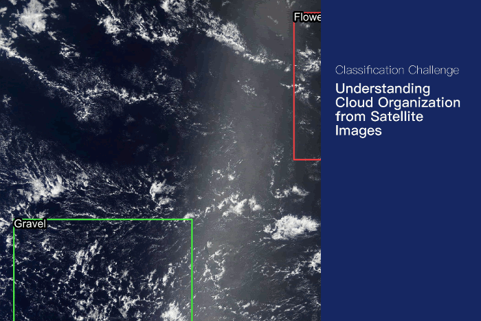

# 【Kaggle】Understanding Clouds from Satellite Images

* 比赛链接：[Understanding Clouds from Satellite Images](https://www.kaggle.com/c/understanding_cloud_organization)

* Public Leaderboard: [121/1538]  Private Leaderboard: [138/1538]（TOP 9%）第二次参加比赛，已经很满足了:) ，之前的比赛中从大佬们那学习到了不少比赛技巧（k-fold交叉验证、TTA、集成等），这次也都进行了尝试。

### 1. OVERVIEW

云的组织模式很大程序上决定了气候的变化，而这些组织模式很难界定，通常需要专家才能区分，举办方希望从卫星拍摄的云图上区分出图片上存在的组织模式。比赛中只要求区分四个模式，分别为`Fish`, `Flower`, `Gravel`, `Sugar`。

### 2. 比赛过程

* 数据分析

  比赛提供训练集5546张，测试集3698张，标签是每个类别的分割结果（感觉做检测更好呢，不懂为什么要做成分割的比赛）

  数据的分析主要考虑以下两点：

  * 类别是否均衡 （统计各类别的mask数量，是均衡的）
  * 是属于多任务二分类还是四分类（绘制mask发现，分割区域是可以重合的，说明是四任务二分类）

* 具体实现

  * 分割网络使用的`segmentation_models_pytorch`、数据扩增使用`albumentations`（从notebook中学习来的，可以很方便的实现4种分割网络，和替换其中的backbone网络）

  * 实验了以下组合：

    * Unet + resnet34 1-fold
    * Unet + resnet50 1-fold
    * Unet + resnet101 1-fold
    * Unet + se_resnext101_32x4d 5-fold
    * FPN + se_resnext101_32x4d  5-fold

    前三种训练精度上不去，最后使用的是后两种组合，同时使用5折交叉验证

  * 预处理

    * 水平翻转 垂直翻转
    * 平移 

  * 后处理

    * 使用阈值和面积大小进行过滤，对每类使用不同的参数
    * 转换成凸包

  * TTA

    * 水平翻转 
    * 垂直翻转
    * 多尺度

  * Ensemble

    尝试了投票法和平均法，Public Leaderboard上测试的平均法效果稍好一些。

    具体操作：

    * 对同一折的两个模型的预测结果取平均
    * 对五折的结果进行投票

